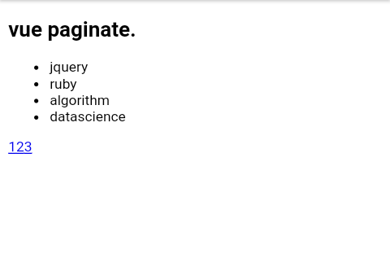

#  VPaginate

> simple vue pagination plugin :rocket: .
 * version: 1.0.0
 * Author: m4rcTr3y
 * Email: marktrevis61@gmail.com
 
 

## configuration:

### javascript
```javascript

  //default config
  var config = {
      perPage:3,
      componentName:'v-paginate',
      className:'v-paginate'
      
  };
  
  //activate plugin
  Vue.use(Vpaginate,config);

```

### html
> We use the "v-paginate" component provided by default from the vpaginate library.

> Data to be paginated can then be bond to the element using the "vdata" prop

> Then we can define an element/component to output the content that will be paginated wrapped in the "template" tag inside the "vpaginate" component.

> The data can then be accessed from the value passed in the "v-slot" attrubute on the template then  passed down to component or element in this case "li"
```html

  <v-paginate :vdata="mydata">
      <template v-slot="{data}">
        <li>{{data.name}}</li>
      </template>
  </v-paginate>

```
## output:



> ## Configuration Options

Option | value
-------|------
**perPage**   |    _default_: 3 "sets how many item to display per page"
**componentName** |   _default_: ("v-paginate")  sets the name of the pagination component that renders and paginates the items
**className**     |  _default_: ("v-paginate")  sets the class name to be used to apply css to the pagination component.
 